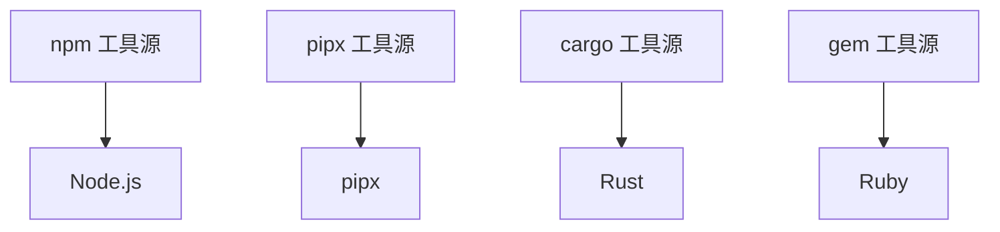

# 工具源架构

了解 mise 的工具源系统有助于你为工具选择合适的工具源，并在出现问题时排查。大多数用户不需要显式选择工具源，因为 [mise 注册表](../registry.md)定义了合理的默认值，但理解这套系统在需要特定工具或优化性能时会有帮助。

## 什么是工具源？

工具源（Backend）是 mise 支持不同工具安装方式的机制。每个工具源负责：

- 列出工具的可用版本
- 下载和安装特定版本
- 为已安装的工具配置环境
- 管理工具生命周期（更新、卸载）

可以把工具源理解为"适配器"，让 mise 能与不同的包管理器和安装系统协同工作。

## Backend Trait 系统

所有工具源实现了一个通用接口（在 Rust 中称为"trait"），这意味着它们都提供相同的基本功能：

```rust
pub trait Backend {
    async fn list_remote_versions(&self) -> Result<Vec<String>>;
    async fn install_version(&self, ctx: &InstallContext, tv: &ToolVersion) -> Result<()>;
    async fn uninstall_version(&self, tv: &ToolVersion) -> Result<()>;
    // ... 其他方法
}
```

这种设计使 mise 可以统一对待所有工具源，而每个工具源各自处理其安装方式的细节。

## 工具源类型

### 核心工具

直接内置在 mise 中，用 Rust 编写以获得高性能和可靠性：

- **Node.js、Python、Ruby、Go、Java 等** - 原生实现
- **优点**：最快的性能，无外部依赖，最佳集成度
- **缺点**：维护成本高；除非是 Node.js、Python、Go 等非常流行的工具，否则新的核心工具贡献可能会被拒绝

::: info
Node.js 和 Java 等核心工具虽然只代表单个工具，但仍作为工具源实现。这种统一的工具源架构使 mise 能以相同方式处理所有工具，无论是复杂的生态系统还是单个工具。
:::

### 语言包管理器

利用已有的语言生态系统：

- **npm** - npm 包（`npm:prettier`、`npm:typescript`）
- **pipx** - Python 包（`pipx:black`、`pipx:poetry`）
- **cargo** - Rust crate（`cargo:ripgrep`、`cargo:fd-find`）
- **gem** - Ruby gem（`gem:bundler`、`gem:rails`）
- **go** - Go 模块（`go:github.com/golangci/golangci-lint/cmd/golangci-lint`）

### 通用安装器

#### aqua - 综合包管理器

基于注册表的包管理器，安全功能强大：

- **用法**：`aqua:golangci/golangci-lint`
- **要求**：工具需在 [aqua 注册表](https://github.com/aquaproj/aqua-registry)中可用
- **来源**：主要是 GitHub，也通过注册表配置支持其他来源
- **安全性**：完整的校验和、签名和验证支持

#### ubi - 通用二进制安装器（已弃用）

::: warning
ubi 工具源已弃用。请改用 [github 工具源](/dev-tools/backends/github)。
:::

零配置安装器，适用于遵循标准惯例的任何 GitHub/GitLab 仓库：

- **用法**：`ubi:BurntSushi/ripgrep` → 迁移到 `github:BurntSushi/ripgrep`
- **要求**：仓库须遵循标准的 release tarball 惯例
- **来源**：主要是 GitHub release，也支持 GitLab（在 mise 中很少使用）
- **配置**：无需配置 - 自动检测并下载适合的二进制文件

### 插件系统

支持外部插件生态：

- **工具插件** - 基于钩子的单工具插件（`my-tool`）- 是 vfox 插件功能的超集
- **asdf 插件** - 旧版插件生态（`asdf:postgres`、`asdf:redis`）- 通常仅支持 Linux/macOS
- **工具源插件** - 增强型插件，使用 `plugin:tool` 格式（`my-plugin:some-tool`）- 支持私有/自定义工具的 backend 方法

## 工具源选择机制

指定工具时，mise 按以下优先级确定工具源：

1. **显式指定工具源**：`mise use aqua:golangci/golangci-lint`
2. **环境变量覆盖**：`MISE_BACKENDS_<TOOL>`（见下文）
3. **注册表查找**：`mise use golangci-lint` → 查询注册表获取默认工具源
4. **核心工具**：`mise use node` → 使用内置核心工具源
5. **回退**：如果未找到，提示可用的工具源

[mise 注册表](../registry.md)为每个工具定义了工具源的优先顺序，因此终端用户通常不需要知道选择哪个工具源，除非需要注册表中没有的工具或想覆盖默认选择。

### 环境变量覆盖

可以使用 `MISE_BACKENDS_<TOOL>` 环境变量模式覆盖任何工具的工具源。工具名转换为大写蛇形命名（大写字母，连字符替换为下划线）。

```bash
# 使用 vfox 工具源安装 php
export MISE_BACKENDS_PHP='vfox:mise-plugins/vfox-php'
mise install php@latest
```

### 注册表系统

[注册表](../registry.md)（`mise registry`）将简称映射到完整的工具源规格，带有优先顺序：

```toml
# ~/.config/mise/config.toml
[tool_alias]
go = "core:go"                    # 使用核心工具源
terraform = "aqua:hashicorp/terraform"  # 使用 aqua 工具源
```

## 工具源功能对比

| 功能                  | 核心 | npm/pipx/cargo | aqua | ubi | 工具源插件 | 工具插件 (vfox) | asdf 插件（旧版） |
| --------------------- | ---- | -------------- | ---- | --- | ---------- | --------------- | ----------------- |
| **速度**              | ✅   | ⚠️             | ✅   | ✅  | ⚠️         | ⚠️              | ⚠️                |
| **安全性**            | ✅   | ⚠️             | ✅   | ⚠️  | ⚠️         | ⚠️              | ⚠️                |
| **Windows 支持**      | ✅   | ✅             | ✅   | ✅  | ✅         | ✅              | ❌                |
| **环境变量支持**      | ✅   | ❌             | ❌   | ❌  | ✅         | ✅              | ✅                |
| **自定义脚本**        | ✅   | ❌             | ❌   | ❌  | ✅         | ✅              | ✅                |
| **内置模块**          | ✅   | ❌             | ❌   | ❌  | ✅         | ✅              | ❌                |
| **安全认证**          | ❌   | ❌             | ✅   | ❌  | ✅         | ✅              | ❌                |
| **多工具插件**        | ❌   | ❌             | ❌   | ❌  | ✅         | ❌              | ❌                |
| **进度/日志**         | ✅   | ✅             | ✅   | ✅  | ✅         | ✅              | ❌                |

## 何时使用各工具源

### 使用**核心工具**当

- 你的工具有核心实现（查看[注册表](../registry.md)）
- 你需要最快的性能
- 你使用的是主流编程语言

核心工具在可用时通常都应该使用，因为它们提供最佳的性能和 mise 集成。

### 使用**语言包管理器**当

- 安装该语言生态系统特有的工具
- 工具主要通过该包管理器分发
- 你需要自动依赖管理

### 使用 **aqua** 当

- 安装预编译二进制文件或静态包（无需编译）
- 你需要全面的安全功能（校验和、签名）
- 你需要 Windows 支持
- 工具已在 [aqua 注册表](https://github.com/aquaproj/aqua-registry)中
- 你愿意为尚未收录的工具贡献到 aqua 注册表

### 使用 **github** 当

- 从 GitHub release 安装预编译二进制文件
- 仓库遵循标准的 release tarball 惯例
- 你需要零配置——无需注册表设置
- 你需要简单快速的二进制安装
- 工具不需要复杂的构建过程或环境配置

::: info
`ubi` 工具源仍然可用但已弃用，建议用 `github` 替代。将 `ubi:owner/repo` 替换为 `github:owner/repo`。
:::

### 使用**工具源插件**当

- 你需要用一个插件管理多个工具
- 需要增强的 backend 方法以获得更好性能
- 需要 `plugin:tool` 格式的灵活性
- 使用自定义或私有工具
- 需要现代插件架构的 backend 方法

### 使用**工具插件**当

- 创建传统的单工具插件
- 需要对安装钩子的精细控制
- 想使用 vfox 钩子系统
- 工具需要复杂的安装逻辑或构建过程
- 工具需要环境变量配置（如 `JAVA_HOME`、`GOROOT` 等）
- 你需要跨平台支持（包括 Windows）

### 使用 **asdf 插件**当

- 工具需要从源码编译
- 需要复杂的安装逻辑或构建过程
- 工具需要环境变量配置（如 `JAVA_HOME`、`GOROOT` 等）
- 没有其他工具源支持该工具
- 从现有 asdf 配置迁移
- 在 Linux/macOS 上工作（不支持 Windows）

## 工具源依赖

某些工具源依赖其他工具源：



mise 自动处理这些依赖——在 npm 工具前安装 Node.js，在 pipx 工具前安装 pipx，等等。

## 配置与覆盖

### 禁用工具源

```toml
# ~/.config/mise/config.toml
[settings]
disable_backends = ["asdf", "vfox"] # 不使用这些工具源
```

### 强制指定工具的工具源

```toml
# mise.toml
[tools]
"core:node" = "20"     # 显式使用核心工具源
"aqua:yarn" = "latest" # 使用 aqua 工具源而非默认的（vfox）
```

### 工具源特定设置

某些工具源支持额外配置：

```toml
# mise.toml
[tools]
python = { version = "3.12", virtualenv = ".venv" }  # 核心工具源选项
black = { version = "latest", python = "3.12" }      # pipx 工具源选项
```

## 工具源问题排查

### 调试工具源选择

```bash
mise doctor                   # 检查工具源配置
mise tool python              # 查看某个工具使用的工具源
mise config get tools         # 验证工具配置
```
