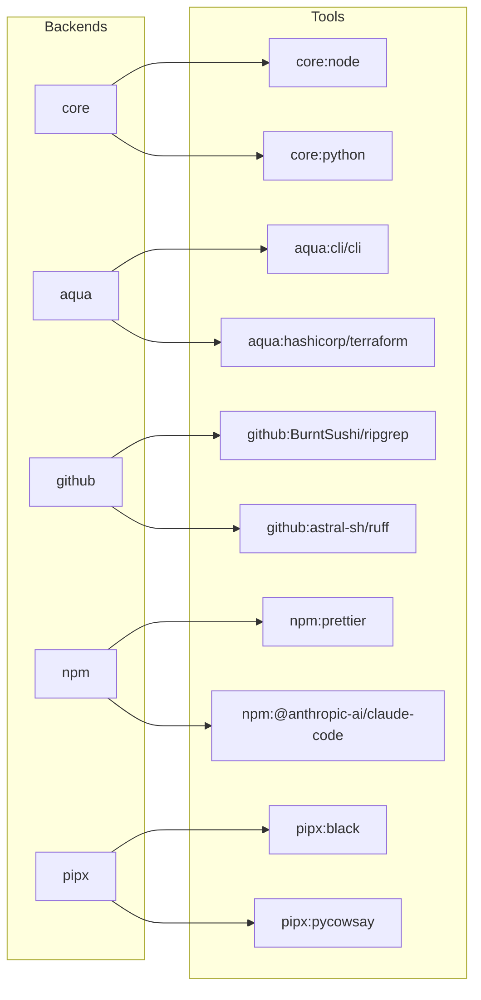

<!-- markdownlint-disable MD034 -->

# 快速开始

本指南将引导你安装 mise 并快速上手。适用于 `bash`、`zsh` 或 `fish` 等交互式 shell 环境。

## 1. 安装 `mise` CLI {#installing-mise-cli}

其他安装方式（`macport`、`apt`、`yum`、`nix` 等）请参阅 [安装 mise](/installing-mise)。

:::tabs key:installing-mise
== Linux/macOS

```shell
curl https://mise.run | sh
```

默认情况下，mise 会安装到 `~/.local/bin`（这只是建议路径，`mise` 可以安装在任何位置）。
你可以通过以下命令验证安装：

```shell
~/.local/bin/mise --version
# mise 2024.x.x
```

- `~/.local/bin` 不需要在 `PATH` 中。mise 在 [激活](#activate-mise) 后会自动将自身目录添加到 `PATH`。

== Brew

```shell
brew install mise
```

== Windows
::: code-group

```shell [winget]
winget install jdx.mise
```

```shell [scoop]
# https://github.com/ScoopInstaller/Main/pull/6374
scoop install mise
```

```shell [chocolatey]
choco install mise
```

== Debian/Ubuntu (apt)

```sh
sudo apt update -y && sudo apt install -y curl
sudo install -dm 755 /etc/apt/keyrings
curl -fSs https://mise.jdx.dev/gpg-key.pub | sudo tee /etc/apt/keyrings/mise-archive-keyring.asc 1> /dev/null
echo "deb [signed-by=/etc/apt/keyrings/mise-archive-keyring.asc] https://mise.jdx.dev/deb stable main" | sudo tee /etc/apt/sources.list.d/mise.list
sudo apt update -y
sudo apt install -y mise
```

== Fedora 41+, RHEL/CentOS Stream 9+ (dnf)

```sh
sudo dnf copr enable jdxcode/mise
sudo dnf install mise
```

详情请参阅 [copr 页面](https://copr.fedorainfracloud.org/coprs/jdxcode/mise/)。

== Snap (beta)

```sh
sudo snap install mise --classic --beta
```

详情请参阅 [snapcraft.io 页面](https://snapcraft.io/mise)。

:::

如果你想更改这些路径，`mise` 支持 [`MISE_DATA_DIR`](/configuration) 和 [`XDG_DATA_HOME`](/configuration) 环境变量。

## 2. mise `exec` 和 `run` {#mise-exec-run}

安装 `mise` 后即可立即开始使用。`mise` 可用于安装和运行[开发工具](/dev-tools/)、启动[任务](/tasks/)以及管理[环境变量](/environments/)。

`mise` 最核心的功能是以指定版本运行[工具](/dev-tools/)。通过 [`mise x|exec`](/cli/exec.html) 可以快速使用指定工具执行 shell 命令。例如，启动 Python 3 交互式终端（REPL）：

> _在以下示例中，如果 `mise` 尚未在 `PATH` 中，请使用 `~/.local/bin/mise`（或 `mise` 的绝对路径）_

```sh
mise exec python@3 -- python
# 如果 Python 尚未安装，将自动下载并安装
# Python 3.13.2
# >>> ...
```

或运行 node 24：

```sh
mise exec node@24 -- node -v
# v24.x.x
```

[`mise x|exec`](/cli/exec.html) 可以在不修改当前 shell 会话的情况下，加载 `mise` 上下文（工具和环境变量）来执行命令，非常适合运行一次性命令。安装[工具](/dev-tools/)只需运行 [`mise u|use`](/cli/use.html)。

```shell
mise use --global node@24 # 安装 node 24 并设为全局默认版本
mise exec -- node my-script.js
# 用 node 24 运行 my-script.js...
```

另一个常用命令是 [`mise r|run`](/cli/run.html)，用于在 `mise` 上下文中运行 [`mise 任务`](/tasks/)或脚本。

::: tip
你可以在 shell 的 rc 文件中设置别名，例如 `alias x="mise x --"`，减少输入量。
:::

## 3. 激活 `mise` <Badge text="可选" /> {#activate-mise}

虽然 [`mise x|exec`](/cli/exec.html) 很实用，但在交互式 shell 中，你可能更希望激活 `mise`，让它自动将工具和环境变量加载到 shell 会话中。另一种方式是使用 [shims](dev-tools/shims.md)。

- [`mise activate`](/cli/activate) 会在每次显示命令提示符时自动更新环境变量和 `PATH`，确保始终使用正确的工具版本。
- [Shims](dev-tools/shims.md) 是指向 `mise` 的符号链接，用于拦截命令调用并加载对应的环境。注意 [**shims 不支持 `mise activate` 的所有功能**](/dev-tools/shims.html#shims-vs-path)。

在交互式 shell 中推荐使用 `mise activate`；在非交互式场景（如 CI/CD、IDE、脚本）中，`shims` 可能更合适。你也可以都不用，直接调用 `mise exec/run`。
详情请参阅 [shims 指南](dev-tools/shims.md)。

以下是根据你的 shell 和安装方式激活 `mise` 的方法：

:::tabs key:installing-mise

== https://mise.run

::: code-group

```sh [bash]
echo 'eval "$(~/.local/bin/mise activate bash)"' >> ~/.bashrc
```

```sh [zsh]
echo 'eval "$(~/.local/bin/mise activate zsh)"' >> ~/.zshrc
```

```sh [fish]
echo '~/.local/bin/mise activate fish | source' >> ~/.config/fish/config.fish
```

== Brew

::: code-group

```sh [bash]
echo 'eval "$(mise activate bash)"' >> ~/.bashrc
```

```sh [zsh]
echo 'eval "$(mise activate zsh)"' >> ~/.zshrc
```

```sh [fish]
# 无需操作！使用 brew 安装时 fish 会自动激活 mise
# 如需禁用此行为，运行 `set -Ux MISE_FISH_AUTO_ACTIVATE 0`
```

== Windows

将以下内容添加到你的 PowerShell 配置文件（`$PROFILE`）中：

```powershell
(&mise activate pwsh) | Out-String | Invoke-Expression
```

如需打开你的 PowerShell 配置文件：

```powershell
# 如果配置文件不存在则创建
if (-not (Test-Path $profile)) { New-Item $profile -Force }
# 打开配置文件
Invoke-Item $profile
```

- 如果不使用 PowerShell，请将 `<homedir>\AppData\Local\mise\shims` 添加到 `PATH`。

== 其他包管理器

::: code-group

```sh [bash]
echo 'eval "$(mise activate bash)"' >> ~/.bashrc
```

```sh [zsh]
echo 'eval "$(mise activate zsh)"' >> ~/.zshrc
```

```sh [fish]
echo 'mise activate fish | source' >> ~/.config/fish/config.fish
```

:::

修改 rc 文件后，请确保重启 shell 会话以使其生效。
你可以运行 [`mise dr|doctor`](/cli/doctor.html) 来验证 mise 是否已正确安装和激活。

现在 `mise` 已经激活（或其 shims 已添加到 `PATH`），`node` 也可以直接使用了！（无需 `mise exec`）：

```sh
mise use --global node@24
node -v
# v24.x.x
```

注意，运行 `mise use --global node@24` 后，`mise` 会自动更新全局配置文件。

```toml [~/.config/mise/config.toml]
[tools]
node = "24"
```

## 4. 通过工具源安装工具（npm、pipx、core、aqua、github） {#tool-backends}



工具源（Backend）是 mise 安装工具时所依赖的生态系统或包管理器。通过 `mise use`，你可以从不同的工具源安装各种工具。

例如，通过 npm 工具源安装 [claude-code](https://www.npmjs.com/package/@anthropic-ai/claude-code)：

```sh
# 通过 mise x|exec 运行 claude-code
mise exec npm:@anthropic-ai/claude-code -- claude --version

# 或者如果 mise 已在 shell 中激活
mise use --global npm:@anthropic-ai/claude-code
claude --version
```

通过 pipx 工具源安装 [black](https://github.com/psf/black)：

```sh
# 通过 mise x|exec 运行 black
mise exec pipx:black -- black --version

# 或者如果 mise 已在 shell 中激活
mise use --global pipx:black
black --version
```

mise 还可以通过 github 工具源直接从 GitHub 安装工具：

```sh
# 通过 mise x|exec 运行 ripgrep
mise exec github:BurntSushi/ripgrep -- rg --version

# 或者如果 mise 已在 shell 中激活
mise use --global github:BurntSushi/ripgrep
rg --version
```

更多工具源和详细信息请参阅[工具源](/dev-tools/backends/)。

## 5. 设置环境变量 {#environment-variables}

你可以在 `mise.toml` 中设置环境变量，当 mise 激活或在目录中使用 `mise x|exec` 时这些变量会被设置：

```toml [mise.toml]
[env]
NODE_ENV = "production"
```

```sh
mise exec -- node --eval 'console.log(process.env.NODE_ENV)'

# 或者如果 mise 已在 shell 中激活
echo "node env: $NODE_ENV"
# node env: production
```

## 6. 运行任务 {#run-a-task}

你可以在 `mise.toml` 中定义简单的任务，并使用 `mise run` 运行它们：

```toml [mise.toml]
[tasks]
hello = "echo hello from mise"
```

运行：

```sh
mise run hello
# hello from mise
```

:::tip
mise 任务会在运行前自动安装 `mise.toml` 中的所有工具。
:::

更多关于如何定义和使用任务的信息，请参阅[任务](/tasks/)。

## 7. 下一步 {#next-steps}

请查看[使用教程](/walkthrough)获取更多 mise 使用示例。

### 设置自动补全 {#autocompletion}

请参阅[自动补全](/installing-mise.html#autocompletion)了解如何为你的 shell 设置自动补全。

### GitHub API 速率限制 {#github-api-rate-limiting}

::: warning
mise 中的许多工具需要使用 GitHub API。未经身份验证的 GitHub API 请求通常会受到速率限制。如果在使用 mise 时遇到 4xx 错误，你可以将 `MISE_GITHUB_TOKEN` 或 `GITHUB_TOKEN` 设置为[在此生成的令牌](https://github.com/settings/tokens/new?description=MISE_GITHUB_TOKEN)，这通常可以解决问题。该令牌不需要任何权限范围。
:::
