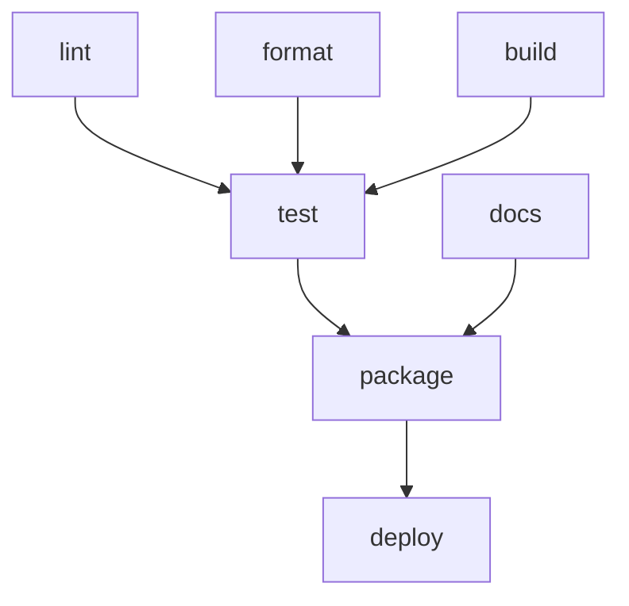

# 任务系统架构

了解 mise 任务系统的工作原理，有助于你编写更高效的任务并排查依赖问题。

## 任务依赖系统

mise 使用精密的依赖图系统来管理任务执行顺序和并行度。这确保任务按正确顺序运行，同时通过并行执行最大化性能。

### 依赖图解析

当你运行 `mise run build` 时，mise 会创建一个包含所有任务及其依赖关系的有向无环图（DAG）：



此图确保：

- 依赖项先于被依赖项运行
- 独立的任务并行运行
- 不存在循环依赖
- 依赖项失败时阻止被依赖项运行

### 依赖类型

mise 支持三种任务依赖类型：

#### `depends` - 前置依赖

必须在此任务运行之前成功完成的任务：

```toml
[tasks.test]
depends = ["lint", "build"]
run = "npm test"
```

#### `depends_post` - 后置任务

在此任务完成后运行的任务（无论成功与否）：

```toml
[tasks.deploy]
depends = ["build", "test"]
depends_post = ["cleanup", "notify"]
run = "kubectl apply -f deployment.yaml"
```

#### `wait_for` - 软依赖

如果这些任务在当前执行中，则应先运行，但如果不存在也不会失败：

```toml
[tasks.integration-test]
wait_for = ["start-services"]  # 仅在 start-services 也在运行时等待
run = "npm run test:integration"
```

## 并行执行引擎

### 任务控制

mise 按配置的任务限制并行执行任务：

```bash
mise run --jobs 8 test        # 使用 8 个并行任务
mise run -j 1 test            # 强制顺序执行
```

默认值为 4 个并行任务，但你可以全局配置：

```toml
# ~/.config/mise/config.toml
[settings]
jobs = 8
```

### 执行流程示例

给定以下任务：

```toml
[tasks.lint]
run = "eslint src/"

[tasks.test-unit]
depends = ["lint"]
run = "npm run test:unit"

[tasks.test-integration]
depends = ["lint"]
run = "npm run test:integration"

[tasks.build]
depends = ["test-unit", "test-integration"]
run = "npm run build"
```

使用 `--jobs 2` 执行：

```
时间轴 →
0s:   [lint]
5s:   [test-unit] [test-integration]  # lint 完成后并行运行
15s:  [build]                        # 等待两个测试完成
```

## 任务发现与解析

### 任务来源

mise 按以下顺序从多个来源发现任务：

1. **文件任务**：任务目录中的可执行文件
2. **TOML 任务**：在 `mise.toml` 文件中定义
3. **父目录任务**：从父目录继承

### 任务解析流程

当你运行 `mise run build` 时，mise 会：

1. **发现所有任务** — 从所有配置来源
2. **解析任务名称** — 处理别名和部分匹配
3. **构建依赖图** — 包含所有依赖关系
4. **验证图** — 检查循环依赖
5. **按依赖顺序执行** — 支持并行

### 跨目录的任务解析

父目录的任务在子目录中可用，且可被覆盖：

```
project/
├── mise.toml              # 定义: lint, test, build
└── frontend/
    └── mise.toml          # 覆盖: test, 新增: bundle
```

在 `frontend/` 中，你可以使用：`lint`（来自父目录）、`test`（被覆盖）、`build`（来自父目录）、`bundle`（本地）。

## 高级依赖特性

### 条件依赖

使用任务参数实现条件行为：

```toml
[tasks.test]
depends = ["build"]
run = '''
if [ "$1" = "--with-lint" ]; then
  mise run lint
fi
npm test
'''
```

### 动态依赖

任务可以在运行时指定依赖：

```bash
#!/usr/bin/env bash
#MISE depends=["setup"]

# 额外的条件依赖
if [ ! -f ".env" ]; then
  mise run generate-env
fi

npm start
```

### 跨项目依赖

引用其他目录的任务：

```toml
[tasks.deploy-all]
depends = [
  "../api:build",
  "../frontend:build",
  "deploy-infrastructure"
]
run = "echo 'All services deployed'"
```

## 性能优化

### 源文件和输出跟踪

任务可以在源文件未更改时跳过执行：

```toml
[tasks.build]
sources = ["src/**/*.ts", "package.json"]
outputs = ["dist/**/*"]
run = "npm run build"
```

mise 仅在以下情况下运行任务：

- 源文件比输出文件更新
- 任务从未运行过
- 依赖已更改

### 增量执行

使用 `mise run --force` 忽略源文件/输出检查：

```bash
mise run --force build     # 始终运行，忽略源文件变化
```

### 并行文件监视

使用 `mise watch` 进行持续开发：

```bash
mise watch              # 监视所有任务源文件
mise watch build test   # 监视特定任务
```

当源文件变化时自动重新运行任务。

## 调试任务依赖

### 可视化依赖

```bash
mise tasks deps build           # 显示 build 的依赖
mise tasks deps --dot > deps.dot # 生成 graphviz 图
```

### 执行追踪

```bash
mise run --verbose build       # 显示任务执行详情
mise run --dry-run build       # 显示将要执行的内容但不实际执行
```

### 常见问题

**循环依赖**：

```
Error: Circular dependency detected: test → build → test
```

解决方案：移除循环引用，或使用 `wait_for` 代替 `depends`。

**缺失依赖**：

```
Error: Task 'build' depends on 'lint' but 'lint' was not found
```

解决方案：定义缺失的任务或移除该依赖。

**并行执行缓慢**：

- 检查任务是否有不必要的依赖
- 使用 `mise tasks deps` 验证依赖图
- 如果有可用的 CPU 核心，考虑增加 `--jobs`

任务架构设计为可从简单的单任务项目扩展到具有复杂构建依赖的多服务应用。
