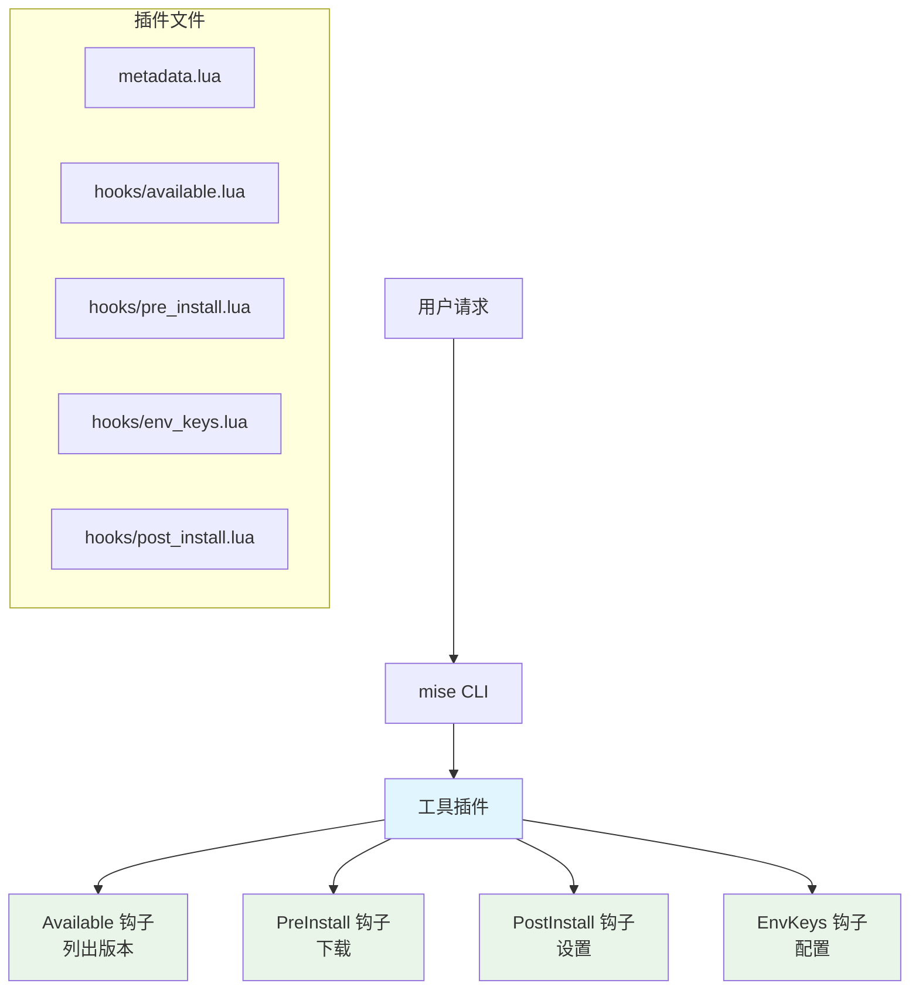

# 工具插件开发

::: tip
[mise-tool-plugin-template](https://github.com/jdx/mise-tool-plugin-template) 提供了一个开箱即用的起点，预配置了 LuaCATS 类型定义、stylua 格式化和 hk 代码检查。
:::

工具插件使用基于钩子的架构来管理各个工具。它们与标准 vfox 生态系统兼容，非常适合需要复杂安装逻辑、环境配置或旧版文件解析的工具。

## 什么是工具插件？

工具插件使用传统的钩子函数来管理单个工具。它们提供：

- **标准 vfox 兼容性**：同时支持 mise 和 vfox
- **复杂安装逻辑**：处理源码编译、自定义构建和复杂设置
- **环境配置**：设置超出 PATH 之外的复杂环境变量
- **旧版文件支持**：解析其他工具的版本文件（`.nvmrc`、`.tool-version` 等）
- **跨平台支持**：支持 Windows、macOS 和 Linux

## 插件架构

工具插件使用 Lua（目前为 5.1 版本）实现。它们使用基于钩子的架构，为不同的生命周期事件提供特定函数：



## 钩子函数

### 必需钩子

以下钩子必须实现才能使插件正常工作：

#### Available 钩子

列出工具的所有可用版本：

```lua
-- hooks/available.lua
function PLUGIN:Available(ctx)
    local args = ctx.args  -- 用户参数

    -- 返回可用版本数组
    return {
        {
            version = "20.0.0",
            note = "Latest"
        },
        {
            version = "18.18.0",
            note = "LTS",
            addition = {
                {
                    name = "npm",
                    version = "9.8.1"
                }
            }
        }
    }
end
```

##### 滚动发布

对于具有滚动发布版本（如 "nightly" 或 "stable"）的工具，版本字符串保持不变但内容会变化，你可以将版本标记为滚动发布并提供校验和用于更新检测：

```lua
function PLUGIN:Available(ctx)
    return {
        {
            version = "nightly",
            note = "Latest development build",
            rolling = true,  -- 标记为滚动发布
            checksum = "abc123..."  -- 发布资源的 SHA256
        },
        {
            version = "stable",
            note = "Latest stable release",
            rolling = true,
            checksum = "def456..."
        },
        {
            version = "1.0.0",
            note = "Fixed release"
            -- 固定版本不需要 rolling 或 checksum
        }
    }
end
```

当设置 `rolling = true` 时：

- `mise upgrade` 会检查校验和是否变化来检测更新
- `mise upgrade --bump` 会保留版本名称（例如 "nightly"），而不是将其转换为语义化版本

校验和应该是用户平台对应的发布资源的 SHA256 哈希值。请参见 [vfox-neovim 插件](https://github.com/mise-plugins/vfox-neovim)了解完整示例。

#### PreInstall 钩子

处理预安装逻辑并返回下载信息：

```lua
-- hooks/pre_install.lua
function PLUGIN:PreInstall(ctx)
    local version = ctx.version
    local runtimeVersion = ctx.runtimeVersion

    -- 确定下载 URL 和校验和
    local url = "https://nodejs.org/dist/v" .. version .. "/node-v" .. version .. "-linux-x64.tar.gz"

    return {
        version = version,
        url = url,
        sha256 = "abc123...",  -- 可选校验和
        note = "Installing Node.js " .. version,
        -- 可选的验证元数据，选择一种验证类型
        attestation = {
            -- GitHub
            github_owner = "ownername"
            github_repo = "reponame"
            -- Cosign
            cosign_sig_or_bundle_path = "/path/to/sig/or/bundle/file"
            -- SLSA
            slsa_provenance_path = "/path/to/provenance/file"
        },
        -- 可以指定额外文件
        addition = {
            {
                name = "npm",
                url = "https://registry.npmjs.org/npm/-/npm-" .. npm_version .. ".tgz"
            }
        }
    }
end
```

#### EnvKeys 钩子

为已安装的工具配置环境变量：

```lua
-- hooks/env_keys.lua
function PLUGIN:EnvKeys(ctx)
    local mainPath = ctx.path
    local runtimeVersion = ctx.runtimeVersion
    local sdkInfo = ctx.sdkInfo['nodejs']
    local path = sdkInfo.path
    local version = sdkInfo.version
    local name = sdkInfo.name

    return {
        {
            key = "NODE_HOME",
            value = mainPath
        },
        {
            key = "PATH",
            value = mainPath .. "/bin"
        },
        -- 多个 PATH 条目会自动合并
        {
            key = "PATH",
            value = mainPath .. "/lib/node_modules/.bin"
        }
    }
end
```

### 可选钩子

这些钩子提供额外功能：

#### PostInstall 钩子

在安装后执行额外设置：

```lua
-- hooks/post_install.lua
function PLUGIN:PostInstall(ctx)
    local rootPath = ctx.rootPath
    local runtimeVersion = ctx.runtimeVersion
    local sdkInfo = ctx.sdkInfo['nodejs']
    local path = sdkInfo.path
    local version = sdkInfo.version

    -- 编译原生模块、设置权限等
    local result = os.execute("chmod +x " .. path .. "/bin/*")
    if result ~= 0 then
        error("Failed to set permissions")
    end

    -- 不需要返回值
end
```

#### PreUse 钩子

在使用前修改版本：

```lua
-- hooks/pre_use.lua
function PLUGIN:PreUse(ctx)
    local version = ctx.version
    local previousVersion = ctx.previousVersion
    local installedSdks = ctx.installedSdks
    local cwd = ctx.cwd
    local scope = ctx.scope  -- global/project/session

    -- 可选地修改版本
    if version == "latest" then
        version = "20.0.0"  -- 解析为特定版本
    end

    return {
        version = version
    }
end
```

#### ParseLegacyFile 钩子

解析其他工具的版本文件：

```lua
-- hooks/parse_legacy_file.lua
function PLUGIN:ParseLegacyFile(ctx)
    local filename = ctx.filename
    local filepath = ctx.filepath
    local versions = ctx:getInstalledVersions()

    -- 读取并解析文件
    local file = require("file")
    local content = file.read(filepath)
    local version = content:match("v?([%d%.]+)")

    return {
        version = version
    }
end
```

## 创建工具插件

### 使用模板仓库

创建新工具插件最简单的方式是使用 [mise-tool-plugin-template](https://github.com/jdx/mise-tool-plugin-template) 仓库作为起点：

```bash
# 克隆模板
git clone https://github.com/jdx/mise-tool-plugin-template my-tool-plugin
cd my-tool-plugin

# 移除模板的 git 历史并重新开始
rm -rf .git
git init

# 为你的工具自定义插件
# 编辑 metadata.lua、hooks/*.lua 文件等
```

模板包含：

- 预配置的插件结构，包含所有必需钩子
- 带注释的示例实现
- 代码检查配置（`.luacheckrc`、`stylua.toml`）
- 使用 mise 任务的测试配置
- GitHub Actions CI 工作流

### 1. 插件结构

创建以下结构的目录（或使用上面的模板）：

```
my-tool-plugin/
├── metadata.lua          # 插件元数据和配置
├── hooks/               # 钩子函数目录
│   ├── available.lua    # 列出可用版本 [必需]
│   ├── pre_install.lua  # 预安装钩子 [必需]
│   ├── env_keys.lua     # 环境配置 [必需]
│   ├── post_install.lua # 安装后钩子 [可选]
│   ├── pre_use.lua      # 使用前钩子 [可选]
│   └── parse_legacy_file.lua # 旧版文件解析器 [可选]
├── lib/                 # 共享库代码 [可选]
│   └── helper.lua       # 辅助函数
└── test/               # 测试脚本 [可选]
    └── test.sh
```

### 2. metadata.lua

配置插件元数据和旧版文件支持：

```lua
-- metadata.lua
PLUGIN = {
    name = "nodejs",
    version = "1.0.0",
    description = "Node.js runtime environment",
    author = "Plugin Author",

    -- 此插件可以解析的旧版版本文件
    legacyFilenames = {
        '.nvmrc',
        '.node-version'
    }
}
```

### 3. 辅助库

在 `lib/` 目录中创建共享函数：

```lua
-- lib/helper.lua
local M = {}

function M.get_arch()
    -- 使用 vfox/mise 提供的 RUNTIME 对象
    local arch = RUNTIME.archType
    if arch == "amd64" then
        return "x64"
    elseif arch == "386" then
        return "x86"
    elseif arch == "arm64" then
        return "arm64"
    else
        return arch  -- 其他架构原样返回
    end
end

function M.get_os()
    -- 使用 vfox/mise 提供的 RUNTIME 对象
    local os = RUNTIME.osType
    if os == "Windows" then
        return "win"
    elseif os == "Darwin" then
        return "darwin"
    else
        return "linux"
    end
end

function M.get_platform()
    return M.get_os() .. "-" .. M.get_arch()
end

return M
```

## 实际示例：vfox-nodejs

以下是基于 vfox-nodejs 插件的完整示例，演示了所有概念：

### Available 钩子示例

```lua
-- hooks/available.lua
function PLUGIN:Available(ctx)
    local http = require("http")
    local json = require("json")

    -- 从 Node.js API 获取版本
    local resp, err = http.get({
        url = "https://nodejs.org/dist/index.json"
    })

    if err ~= nil then
        error("Failed to fetch versions: " .. err)
    end

    local versions = json.decode(resp.body)
    local result = {}

    for i, v in ipairs(versions) do
        local version = v.version:gsub("^v", "")  -- 移除 'v' 前缀
        local note = nil

        if v.lts then
            note = "LTS"
        end

        table.insert(result, {
            version = version,
            note = note,
            addition = {
                {
                    name = "npm",
                    version = v.npm
                }
            }
        })
    end

    return result
end
```

### PreInstall 钩子示例

```lua
-- hooks/pre_install.lua
function PLUGIN:PreInstall(ctx)
    local version = ctx.version

    -- 使用 RUNTIME 对象确定平台
    local arch_token
    if RUNTIME.archType == "amd64" then
        arch_token = "x64"
    elseif RUNTIME.archType == "386" then
        arch_token = "x86"
    elseif RUNTIME.archType == "arm64" then
        arch_token = "arm64"
    else
        arch_token = RUNTIME.archType
    end
    local os_token
    if RUNTIME.osType == "Windows" then
        os_token = "win"
    elseif RUNTIME.osType == "Darwin" then
        os_token = "darwin"
    else
        os_token = "linux"
    end
    local platform = os_token .. "-" .. arch_token
    local extension = (RUNTIME.osType == "Windows") and "zip" or "tar.gz"

    -- 构建下载 URL
    local filename = "node-v" .. version .. "-" .. platform .. "." .. extension
    local url = "https://nodejs.org/dist/v" .. version .. "/" .. filename

    -- 获取校验和
    local http = require("http")
    local shasums_url = "https://nodejs.org/dist/v" .. version .. "/SHASUMS256.txt"
    local resp, err = http.get({ url = shasums_url })

    local sha256 = nil
    if err == nil then
        -- 提取我们文件的 SHA256
        for line in resp.body:gmatch("[^\n]+") do
            if line:match(filename) then
                sha256 = line:match("^(%w+)")
                break
            end
        end
    end

    return {
        version = version,
        url = url,
        sha256 = sha256,
        note = "Installing Node.js " .. version .. " (" .. platform .. ")"
    }
end
```

### EnvKeys 钩子示例

```lua
-- hooks/env_keys.lua
function PLUGIN:EnvKeys(ctx)
    local mainPath = ctx.path
    local os_type = RUNTIME.osType

    local env_vars = {
        {
            key = "NODE_HOME",
            value = mainPath
        },
        {
            key = "PATH",
            value = mainPath .. "/bin"
        }
    }

    -- 将 npm 全局模块添加到 PATH
    local npm_global_path = mainPath .. "/lib/node_modules/.bin"
    if os_type == "Windows" then
        npm_global_path = mainPath .. "/node_modules/.bin"
    end

    table.insert(env_vars, {
        key = "PATH",
        value = npm_global_path
    })

    return env_vars
end
```

### PostInstall 钩子示例

```lua
-- hooks/post_install.lua
function PLUGIN:PostInstall(ctx)
    local sdkInfo = ctx.sdkInfo['nodejs']
    local path = sdkInfo.path
    -- 在 Unix 系统上设置可执行权限
    if RUNTIME.osType ~= "Windows" then
        os.execute("chmod +x " .. path .. "/bin/*")
    end

    -- 创建 npm 缓存目录
    local npm_cache_dir = path .. "/.npm"
    os.execute("mkdir -p " .. npm_cache_dir)

    -- 配置 npm 使用本地缓存
    local npm_cmd = path .. "/bin/npm"
    if RUNTIME.osType == "Windows" then
        npm_cmd = path .. "/npm.cmd"
    end

    os.execute(npm_cmd .. " config set cache " .. npm_cache_dir)
    os.execute(npm_cmd .. " config set prefix " .. path)
end
```

### 旧版文件支持

```lua
-- hooks/parse_legacy_file.lua
function PLUGIN:ParseLegacyFile(ctx)
    local filename = ctx.filename
    local filepath = ctx.filepath
    local file = require("file")

    -- 读取文件内容
    local content = file.read(filepath)
    if not content then
        error("Failed to read " .. filepath)
    end

    -- 从不同文件格式解析版本
    local version = nil

    if filename == ".nvmrc" then
        -- .nvmrc 可能包含带或不带 'v' 前缀的版本
        version = content:match("v?([%d%.]+)")
    elseif filename == ".node-version" then
        -- .node-version 通常只包含版本号
        version = content:match("([%d%.]+)")
    end

    -- 移除空白字符
    if version then
        version = version:gsub("%s+", "")
    end

    return {
        version = version
    }
end
```

## 测试插件

### 本地开发

```bash
# 链接插件用于开发
mise plugin link my-tool /path/to/my-tool-plugin

# 测试列出版本
mise ls-remote my-tool

# 测试安装
mise install my-tool@1.0.0

# 测试环境设置
mise use my-tool@1.0.0
my-tool --version

# 测试旧版文件解析（如适用）
echo "2.0.0" > .my-tool-version
mise use my-tool
```

如果你使用的是模板仓库，可以运行内置测试：

```bash
# 运行代码检查
mise run lint

# 运行测试
mise run test
```

### 调试模式

使用调试模式查看详细的插件执行信息：

```bash
mise --debug install nodejs@20.0.0
```

### 插件测试脚本

创建完整的测试脚本：

```bash
#!/bin/bash
# test/test.sh
set -e

echo "Testing nodejs plugin..."

# 安装插件
mise plugin install nodejs .

# 测试基本功能
mise install nodejs@18.18.0
mise use nodejs@18.18.0

# 验证安装
node --version | grep "18.18.0"
npm --version

# 测试旧版文件支持
echo "20.0.0" > .nvmrc
mise use nodejs
node --version | grep "20.0.0"

# 清理
rm -f .nvmrc
mise plugin remove nodejs

echo "All tests passed!"
```

## 最佳实践

### 错误处理

始终提供有意义的错误信息：

```lua
function PLUGIN:Available(ctx)
    local http = require("http")
    local resp, err = http.get({
        url = "https://api.example.com/versions"
    })

    if err ~= nil then
        error("Failed to fetch versions from API: " .. err)
    end

    if resp.status_code ~= 200 then
        error("API returned status " .. resp.status_code .. ": " .. resp.body)
    end

    -- 处理响应...
end
```

### 平台检测

使用 RUNTIME 对象正确处理不同操作系统：

```lua
-- lib/platform.lua
local M = {}

function M.is_windows()
    return RUNTIME.osType == "Windows"
end

function M.get_exe_extension()
    return M.is_windows() and ".exe" or ""
end

function M.get_path_separator()
    return M.is_windows() and "\\" or "/"
end

return M
```

**注意：** `RUNTIME` 对象在所有插件钩子中自动可用，提供：

- `RUNTIME.osType`：操作系统类型（"Windows"、"Linux"、"Darwin"）
- `RUNTIME.archType`：架构（"amd64"、"arm64"、"386" 等）

### 版本规范化

一致地规范化版本：

```lua
local function normalize_version(version)
    -- 移除 'v' 前缀（如存在）
    version = version:gsub("^v", "")

    -- 移除预发布后缀
    version = version:gsub("%-.*", "")

    return version
end
```

### 缓存

缓存开销较大的操作：

```lua
-- 缓存版本 12 小时
local cache = {}
local cache_ttl = 12 * 60 * 60  -- 12 小时（秒）

function PLUGIN:Available(ctx)
    local now = os.time()

    -- 先检查缓存
    if cache.versions and cache.timestamp and (now - cache.timestamp) < cache_ttl then
        return cache.versions
    end

    -- 获取最新数据
    local versions = fetch_versions_from_api()

    -- 更新缓存
    cache.versions = versions
    cache.timestamp = now

    return versions
end
```

## 高级特性

### 条件安装

根据平台或版本使用不同的安装逻辑：

```lua
function PLUGIN:PreInstall(ctx)
    local version = ctx.version

    -- 使用 RUNTIME 对象针对不同平台
    if RUNTIME.osType == "Windows" then
        -- Windows 特定安装
        return install_windows(version)
    elseif RUNTIME.osType == "Darwin" then
        -- macOS 特定安装
        return install_macos(version)
    else
        -- Linux 安装
        return install_linux(version)
    end
end
```

### 源码编译

对于需要从源码编译的插件：

```lua
-- hooks/post_install.lua
function PLUGIN:PostInstall(ctx)
    local sdkInfo = ctx.sdkInfo['tool-name']
    local path = sdkInfo.path
    local version = sdkInfo.version

    -- 进入源码目录
    local build_dir = path .. "/src"

    -- 配置构建
    local configure_result = os.execute("cd " .. build_dir .. " && ./configure --prefix=" .. path)
    if configure_result ~= 0 then
        error("Configure failed")
    end

    -- 编译
    local make_result = os.execute("cd " .. build_dir .. " && make -j$(nproc)")
    if make_result ~= 0 then
        error("Compilation failed")
    end

    -- 安装
    local install_result = os.execute("cd " .. build_dir .. " && make install")
    if install_result ~= 0 then
        error("Installation failed")
    end
end
```

### 环境配置

复杂的环境变量设置：

```lua
function PLUGIN:EnvKeys(ctx)
    local mainPath = ctx.path
    local version = ctx.sdkInfo['tool-name'].version

    local env_vars = {
        -- 标准环境变量
        {
            key = "TOOL_HOME",
            value = mainPath
        },
        {
            key = "TOOL_VERSION",
            value = version
        },

        -- PATH 条目
        {
            key = "PATH",
            value = mainPath .. "/bin"
        },
        {
            key = "PATH",
            value = mainPath .. "/scripts"
        },

        -- 库路径
        {
            key = "LD_LIBRARY_PATH",
            value = mainPath .. "/lib"
        },
        {
            key = "PKG_CONFIG_PATH",
            value = mainPath .. "/lib/pkgconfig"
        }
    }

    -- 平台特定的额外设置
    if RUNTIME.osType == "Darwin" then
        table.insert(env_vars, {
            key = "DYLD_LIBRARY_PATH",
            value = mainPath .. "/lib"
        })
    end

    return env_vars
end
```

## 下一步

- [从插件模板开始](https://github.com/jdx/mise-tool-plugin-template)
- [了解工具源插件开发](backend-plugin-development.md)
- [探索可用的 Lua 模块](plugin-lua-modules.md)
- [发布你的插件](plugin-publishing.md)
- [查看 vfox-nodejs 插件源码](https://github.com/version-fox/vfox-nodejs)
